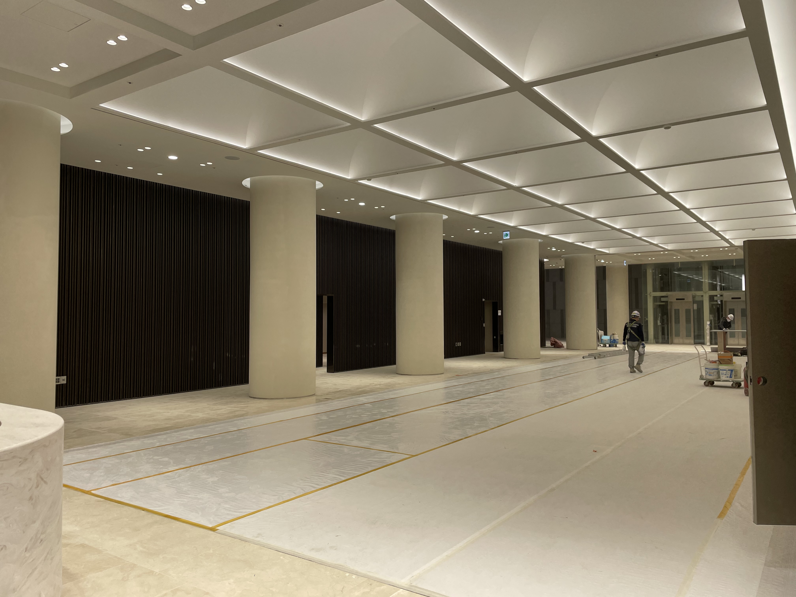

# Caleb's Fulbright Report #4

## Roadmap for Report 
This month was quite the adventure. I will structure this report similar to my previous reports. The first section will focus on research highlights for the month of December. The second section, will focus on my cultural engagements.  

## Severance Research

### ** Meeting with Hosptial Engineer and Dr. Chang **

This month, my mentor, Dr. Chang, set up a meeting with me to and a software engineer at the hopsital that he works closely with to explain a new ambitious project he is leading wihtin the radiation oncology department at Severance. 

More speifically, the purpose of the meeting was to introduce me to the coding part of the project that he would like to me help work on in the coming months. The coding invovles building out a web application that will be used by radiation oncologists at Severance to easily check the quality control of their radiation treatment. In other words, the web application is intended to provide a simple user interface for doctors to query information regarding the performance of planning vs actual treatment in cancer pateints recieving radiation therapy. 

The hospital team of engineers are using PHP, Javascript, and MATLAB to build out the web app, and querying (i.e., selecting) relevant patient attributes from DICOM data in the hospital database (i.e., the standardized form for medical imaging data). I have some experience with web apps using Java, SQL, and Python, as well as some front end coding expereince, but I still anticipate this project will be challenging, maybe outside of my depth. 

We are still currently in the preliminary phases of the project, so right now we are simply focusing on identifying what data is most relevant to include in the web application. The big-picture goal of this project is to create a data storage platform that only contains information that not only has information about Quality Assurance, but also data that is relevant to training deep learning models for predicting CT contours for differnt types of cancer (i.e., automatically differentiates cancer for healthy tissue in the medical imaging scans).  

### ** Dinner with AI research team **

This month, Dr. Chang invited four people from the lab --including me-- to discuss future AI research projects over dinner. He called the carefully selected group the 'AI dream team' which included the most senior PhD candidate in our medical physics lab, a software engineer at Oncosoft --a medical imaging start up--, a 4th year yonsei medical student who has been coding since high school, and myself. 

Over 갈비, I got to learn more about each individual's plans for the future, and dreams of what they wish to accomplish in the medical field using AI techonology. 

I was very impressed with how well Dr. Chang brings diverse people together to collaborate on ambitious research projects. Without someone like Dr. Chang to catalyze these team efforts, I don't think I would have had so many opportunities to engage in such eclectic research projects (e.g., VR, LAT, deep learning). 

### **Meeting with Doctor/Professor from USC Medical School**

Dr. Chang invited David Hong, a guest lecturer and radiation oncology professor/MD from USC Medical School, to give a presentation on big data in the field of radiation oncology this month. After the lecture, me, Dr. Chang, Dr, Hong, and another radiation oncologist were given a guided tour of the new carbon ion center that is currently under construction at Yonsei Severance (see picture provided in the last section of the report). 

After our guided tour, Dr. Hong asked me to grab a coffee with him. This meeting ended up lasting for over two hours. We covered everything from his journey through medical school, residency, and professorship at USC to how he met his spouse in Korea. It was a wonderful meeting and I anticipate meeting with Dr. Hong again someday when I return to the states.

**Now, I will transition into discussing my progress on several research projects I am working on**

Just finished 2 rounds of edits this month helping to write the publication for CAD automating contouring of lung mets in CRC patients (3rd author

## ** Finishing touches to VR and LAT paper **

The virtual reality and the local ablative therapy manuscripts I have been editing over the past two months have gone through a number of drafts and was finialized this month. Dr. Chang informed me that they will be submitting the papers to journals in the near future. Dr. Chang was kind enough to advocate for me to be included as a co-author in both papers because of my hard-work on the projects. 

## **Paper on Automating Identification of Lung Nodules in pateints with Colorectal Cancer **  

Immediately after I finished my work on the LAT paper this month, Dr. Chang invited me to get invovled with writing/editing a new paper. This paper invovles a longitudnal, retrospective study conducted over course of 10+ years at Severance. The purpose was to test the possibility of using an AI detection system, origianlly designed for lung cancer screening diagnosis, to be used for detecting lung metastases or tumor burden (i.e., counting indidvudal lung nodules). With over 200 pateints in the research cohort, the results are promising, showing that the AI detection system can detect lung mets with ~81% sensitvity which comparable to its use with lung cancer screening diagnosis. 

This month, I have write two drafts of the paper, and it seems to be progessing well. I will have futher updates on this project in the next report. 

## Cultural Immersion
In this next section, I am going to use images to take you through some cutlural highlights of this past month in Korea. 

This month, I went to go pick up my yonsei library ID from Professor Yoo (Yonsei humanities prof who spoke at our orientation). He asked me to stick around and talk with him, and we made good conversation for the next 1-2 hours. He was very interested in my AI research at the Severance hospital and my background in coding and invited me to check out a metaverse company that is affliated with. Fast forward 3 weeks. The CEO and top engineer at VRILLAR --the company name-- are showing me the kind of metaverse they are creating for different educational purposes. The office is located right by Seoul National University so it was a bit of a trek, but I very much enjoyed the expereince and found that the work they are doing to be interesting. They are currently looking for backend and frontend engineers and invited me to join their company after my fulbright grant is over. Though I respectfully declined since I am not intersted in NFTs and metaverse stuff, I connected them with my older brother who is a software engineer interested in the area. 

I forget to take pictures at the place, but here is an image of the CEO's card -- I may go back in the future and will hopefully be able to show pictures of the place in a future report.  

This my by the new carbon ion machine they are building at Severance! It's supposed to be one of the 5 in the world --or something crazy like that.

 This is the interior of the building! They are not set to open up officially until sometime next year. The whole building costs over 300 millions USD --according to Dr. Chang.

I took a weekend trip to Busan this month with some friends. They had a Christmas themed light show on the beach :)

This is a picture of me and my korean friend eating 죽 in busan. His name is Shaun, and we first met when I was little on my first visit to Korea.

This month was Prof Kim's birthday! --he is charge of the medical physics lab at Severance. In this picture, some of my lab mates are decorating the lab. 

## Looking Forward
I love Korea! I am looking forward to the my work projects and more cultural engagement opportunities.

