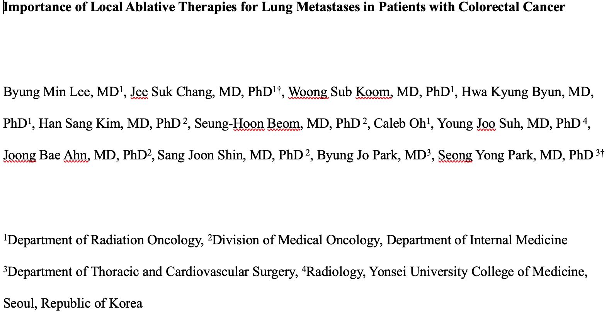
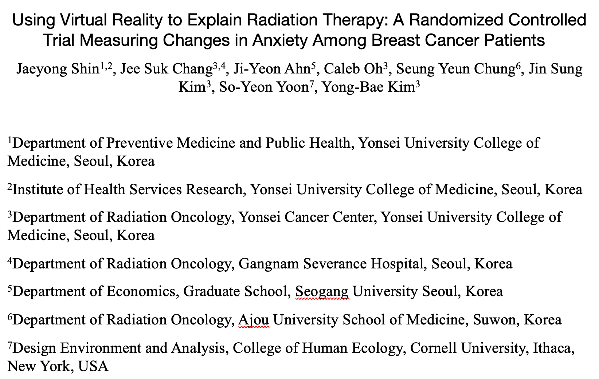
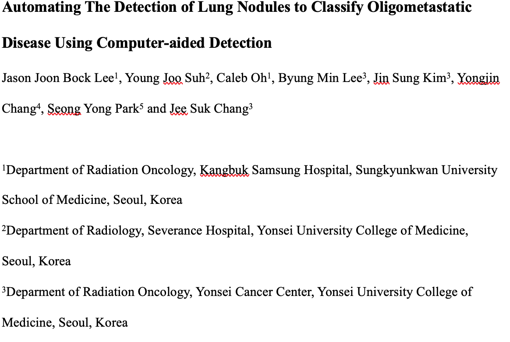
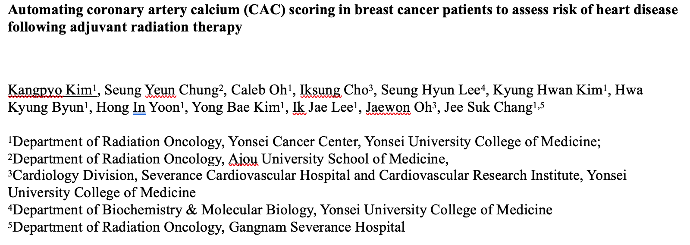
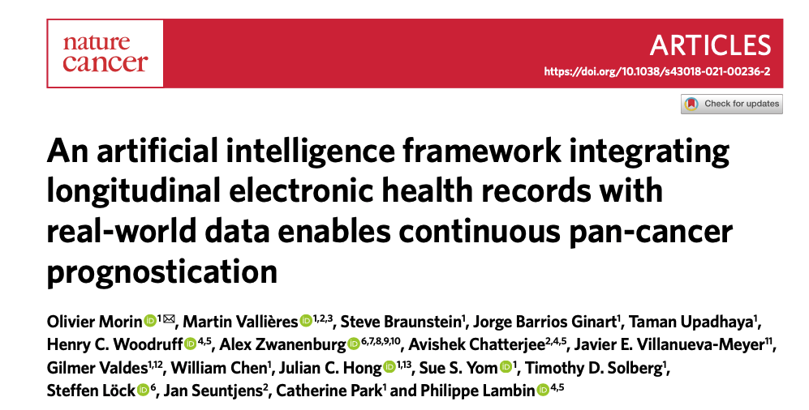

# Caleb's Fulbright Report #5

## Roadmap for Report 
This month was incredibly busy with work. Similar to the organziation of my previous reports, I will divide my report into two sections, the first will be focused on clinical research and the second on cultural engagemnet. 

## Severance Research

### **AI Web Application**

In my last report, I discussed a new project that I am taking the lead on. At a high level overview, this project involves creating a web application that will make it easier for radiation oncologists, engineers, and researchers at Severance to pull data from the hospital database to create AI models. Currently, the format of the data--electronic health record (EHR)-- is stored in such a way that it is highly inaccessible to researchers at the hospital. However, this data could be used as a rich source of data for creating AI models that could have many positive effect on patients in the clinic (e.g., predict pateints who are highest risk for adverse cardiac events (ACEs) based on various attributes which could include factors such smoking status, age, gender, and cancer type).

This project is a long term, highly ambitious project and Dr. Chang said no pressure at all in trying to compelete this project anytime soon. It will likley take until almmost the end of the grant period to finish, but I will put in my best effort to try to get it done earlier. 

To make this project a little less daunting, I decided to break it up into 4 smaller parts:

1. Wire Framing
First, I decided that I needed to agree with Dr. Chang and researchers/engineers about how the website should function at a high level. After doing some research and consulting with my older brothers for some tips --they're more expereinced in software engineering/data engineering-- I settled on using a relatively new software called Figma to make some high-level wire frames of the website. This will allow me to create the design of the website --including all the linked web pages and features --without actually coding the front end in full, which would take a very long time given several iterations. Once we settle on a high level overview design, I will move on to coding the front end. 

2. Front end web design
Next, I will use the Flask framework along with CSS, Java, and HTML to build out the front in way that emulates the design that we agreed on in step 1. 

3. Back-end coding
Then, I will build out the back-end using Python and SQL. This month, I was actually able to get a good sense of the specific SQL queries I would need to write in order to fetch the desired attributes from the hosptial database. This was a lot tricker than I intially thought it would be due to the all the data securtiy measures at Severance. This week, I spent most of my time at the cancer center --instead of the lab which is my homebase-- since I was having network access problems. But, with the help of Dr. Chang, I was able to find a temporary work station in the radiation oncology department where I could view the EHR to idnetify which attributes would be most helpful for creating models. 

4. Test running/Quality Assurance
In this final stage, I would be test running the website just to make sure that there are no edge-cases that I didn't account for. If all is safe and ready to deploy, we will slowly begin allowing researchers at Severance to access the AI dashboard. 

I am very excited for this project because it has the potential to help a lot of pateints as well as researchers while also helping me to further develop my coding skills. 

### **Meeting Youngest Professor at Severance**

This week, I spent a lot of time in the radiation oncology department at the Cancer Center because that was the only place where I could access the EHRs. Throughout the week, as I was working, I got to meet some professors who were curious about my project. One professor introduced herself as a MD/PhD radiation oncologist and the youngest professor at Severance. Her English was excellent and when I asked her where she learned so speak so well, she said from watching Big Bang Theory and Modern Family --two phenomenal shows! 

I am usually working at the lab on a daily basis so I don't often get to meet doctors-- mainly PhD students-- so this month visitng the radiation oncology department was a lot of fun. 

**Now, I will transition into discussing my progress on the medical research papers I have been working on**

Below are three completed manuscripts that I have completed my end of the work on --these papers are currently in the final stages of revision or in the process of peer-view. I will provide the doi/pubmed link following publication. 

## **CAC Score Paper**

This month, I started a new project on the feasbility of using an AI based detection system to calculate CAC score --a proxy for heart disease-- in breast cancer patients. I was happy to work on this project because it very clearly aligns with my initial goal of using AI/deep learning to improve the treatmenet of breast cancer. This month, I worked especially hard on this manuscript and was able to finish the first draft, submit it to co-authors, get feedback, then finished the second draft. I am still waiting for any more revision/feedback. I believe this paper is getting close to submission status. 

## **Artificial Intellegence Framework EHR Paper**  

This month, Dr. Chang and I were on the topic of AI and the web appication dashboard that I creating --mentioned in the intro of report-- and he shared a recent paper that was published in Nature along the lines of what we are doing (see image below). He suggested that I read throught this paper and give a presenation on it on Feb 7th. 

I am not only excited for the opportunity to present to my colleagues-- this will be my debut-- but also to begin working on a similarly designed paper focusing on innovative software called INTEGRO that was recently made by Dr. Chang and his best friend --one of the top medical physicists at Severance-- to significantly increase effeciency in the radiation oncology department at Severance. The Nature article that I will present on describes a new hosptial software that is being used at USC to integrate EHR with the work flow of doctors --mainly by allowing seamless integration with AI models. I am hoping to recruit some collaborators through my presentation. 

I will have more updates on how my presentation goes next week and the progress of this new research paper in my next report. 

## **Feasbiliity and Effectiveness of hybrid therapy --surgery and SABR-- for Lung metastasis**

This past weekend, I just got an email about working on this new paper. I haven't had the chance to read through and write my initial comments on the design yet. But, after looking through the data and the notes on the design, I will schedule my next meeting with Dr. Chang for this week. 

**Now, I will transition into discussing some cultural engagement highlights for this month**

note: I had a lot of work this week, so I didn't do much in terms of cultural engagement.

## Cultural Immersion
### **Tennis with Dr. Chang**

This week Dr. Chang reserved a tennis court for us to play together near Shinchon, but unfortunately he had to cancel last minute due to an emergency.

But, the good this is that my lab mates have reserved two dates in Feb to play tennis! 

### **Skiing with the lab**

Next week, everyone in the lab is going on a day trip to go skiing! I will take pictures and add them in the next report!

## Looking Forward
This next month, I am most looking forward to giving my presentation and going skiing! :)

