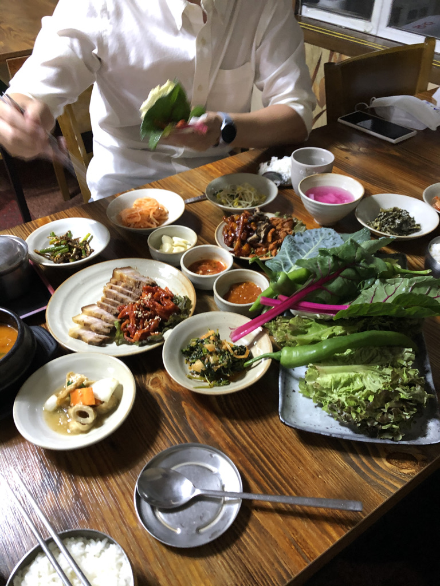
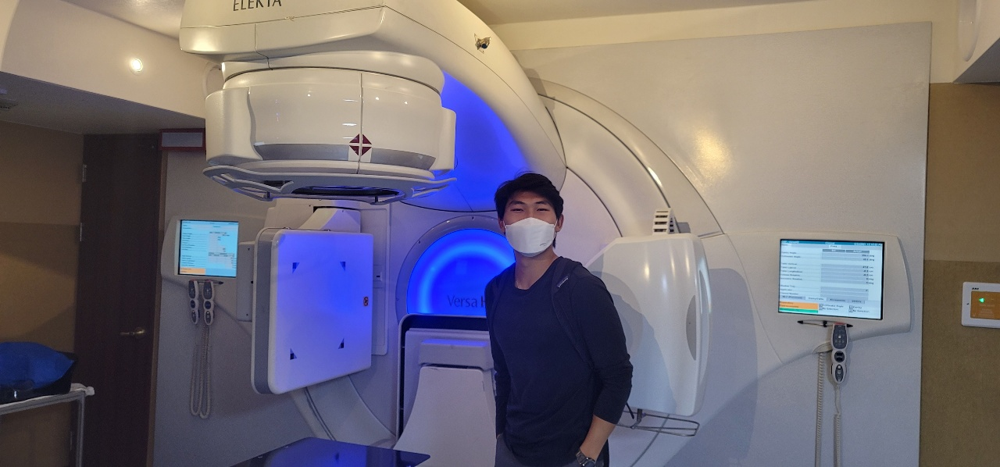
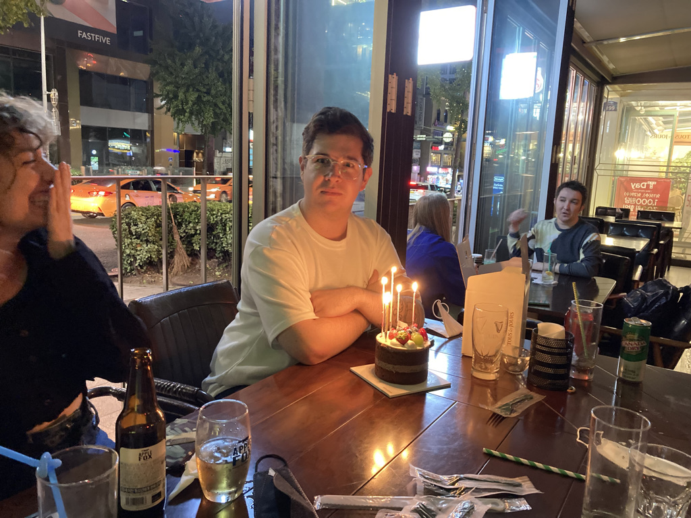
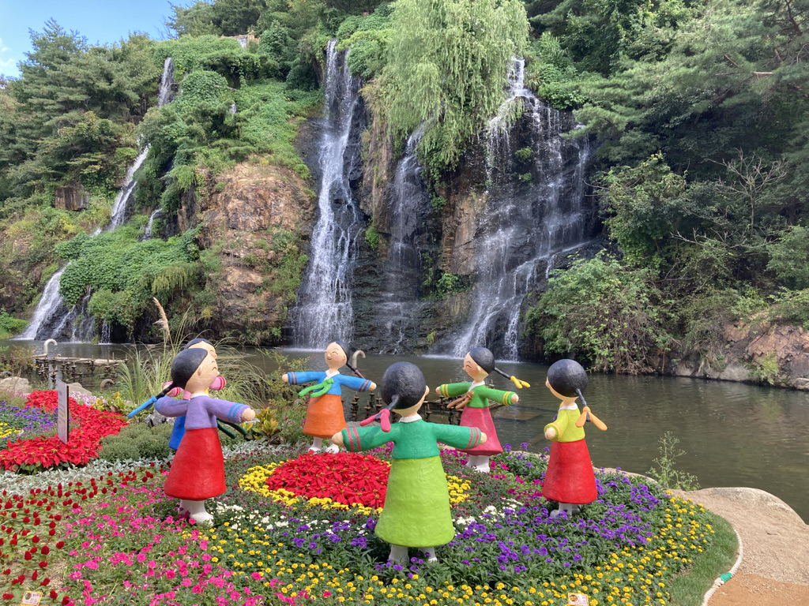
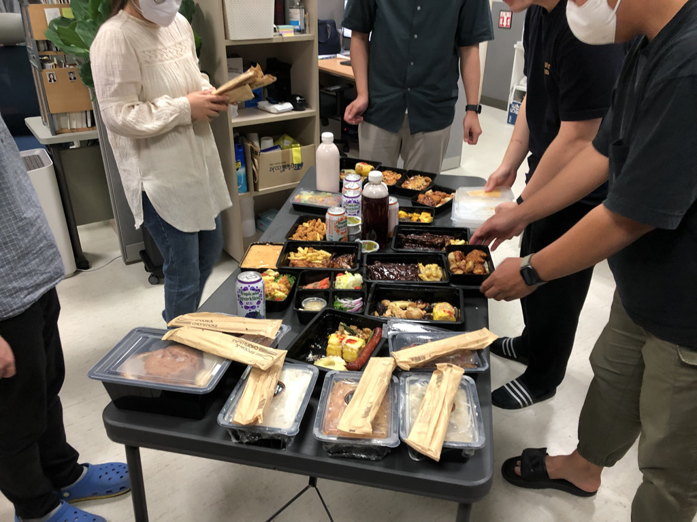
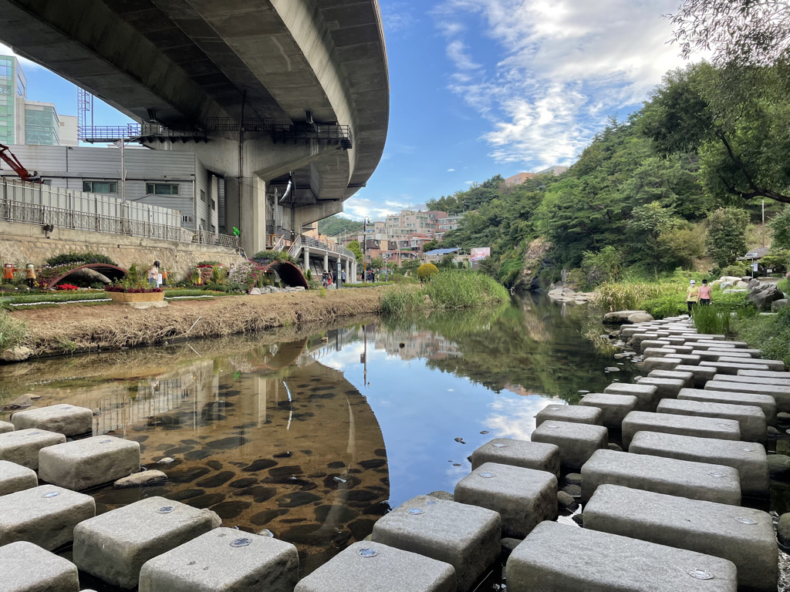
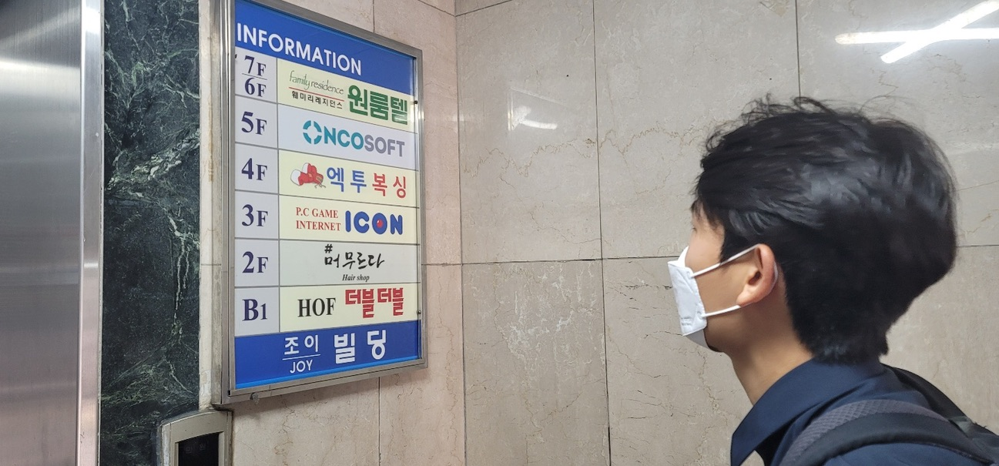

# Caleb's Fulbright Report #1

## Roadmap for Report 
I thought the best way to go about this report is to split it up into two sections: one for my research and one for cultural activities. I will be using a narrative format for this report --I figure this would make the report both engaging and informative. 

## Research

### **First day at Severance Hopstial**
I began my first day of in-person research at the Severance Hospital on September 30th 2021. Dr. Chang, my supervisor and a radiation oncologist and associate professor at Yonsei Severance, met me at front of the cancer center at 9 AM. 

Then, he brought me to the radiation oncology department where he introduced me to his colleagues and the chair of the departement. Then, we went to get coffee together. During this time, we got to know more about each other's lives. 

After coffee, Dr. Chang introduced me to Dr. Kim who is a medical physicist and one of Dr. Chang's best friends. Together, they published over 100 articles last year in different American Medical Journals. Dr. Kim has his own medical physics lab at the Severamce Hospital where I they he made accomodations for me to have my own workspace equpped with two monitors and access to other lab members who are mostly PhD candidates specializing in AI research. I got to check out the lab and meet the lab members during this time.

After visiting the lab, Dr. Chang had to visit patients so he asked a fourth year resident to show me around the cancer center. I learned a lot about the workflow of radiation oncologists during this time --everything from the diagnosis of cancer to countouring (i.e., mapping out cancer vs healthy tissue) CT scans. 

Then, I was introduced to another 4th year resident who is actually an almuni from UPenn --we got to talk about professors that we both had during undergrad which was awesome!

Later in the evening, Dr. Chang and Dr. Kim took me out to dinner in Sinchon. We ate a lot that night (see image below). I got to learn more about both of the doctors over dinner. I realized that I shared a lot in common with the doctors --from our love of tennis and basketball to our Christian faith. 

### **Following Weeks**
In the following weeks, I fell into a regular rhythm --I started going to the lab from 9AM until 6PM each weekday. Right off the bat, Dr. Chang helped me dive right into my research. Below, I provide a short description of 5 different Deep Learning/Machine Learning projects that I am currently working on: 

Before I begin, I would like to preface by saying the scope and focus of my project has not deviated much from my original grant proposal. Since I have been corresponding with Dr. Chang over zoom for the past year, I wasn't caught by suprise by any of the research. The focus of most, if not all my research, is still to use artificial intellegence (e.g., machine learning/deep learning) to improve the diagnosis and treatment of breast cancer. What I mean by "improve" in this context includes anything from reduced cost of treatment to higher efficacy and/or consistency of treatment. 

If anything has changed from my original proposal, it is that the scope of my research has broadened. I will be working on papers that impact more than just breast cancer patients --as you will see in the project descriptons. Below are the projects I am working on with a short description describing the purpose of each paper and what role I am playing in it (for each of these projects, I will be included as either a co-author or first author based on the extend of my responsibility).

## 1. **Auto segmentation & Deep learning in Breast Cancer Diagnosis**
**Purpose**: The recent literature in radiation oncology suggests that metastatic breast cancer actually exists on a spectrum rather than being a categorical, black and white diagnosis. The implication is that cases of metastatic cancer previously deemed untreatable are actually treatable now using continued radiation therapy. Now, a big question among radiation oncologists is a question about classification --how can you tell if this pateint qualifies as treatable or not? In this retrospective study, we will be creating a deep learning model that will determine which cases of metastatic breast cancer is treatable. 

**My Role**: I am  responsible for following tasks:
    1. Determine which variable are important to include for the model (e.g., age, number of recurrences, tumor volume ect)
    2. Developing an AI model use the training data.
    3. Test if the model makes accurate predictions by testing against the half of the training data that wasn't used to create the model. 

## 2. **Review article on breast IMRT**  
**Purpose**: There is a lot of controversy over whether Intensity-modulated radiation therapy (IMRT) --a more innovative cancer treatment-- should be used for the treatment of breast cancer. In the US, this technology is not widely adopted, while in South Korea, over 97% of clinics and hospitals offer it to cancer patients. In this literature review, we are looking at what exactly makes the question of using IMRT controversial. 

**My Role**: I am taking the lead as first author on this paper. this means that I am putting together the scaffolding of the article and assigning roles to different collaborators. In other words, I am creating the backbone of the paper and synthesizing the work of collaborators. 

image description: Me standing next to an IMRT at the Gangnam Severance hospital (usually I am stationed at Yonsei Severance, but on this day I shadowed my supervisor at the Gangnam location)

## 3. **ML with National database & Yonsei data**  
**Purpose**: Use the korean national database and Yonsei Severance's internal database to identify significant patterns in the clinical data using machine learning algorithms.

**My Role**: 
1. Figure out all the variables that you would like to investigate for the study. (i.e., side effects patient ids ect).
2. Run machine learning algorithm using python package a priori --similar towhat I did in  my informatics lab at UPenn.

## 4. **VR for Radiotherapy Explanations**  
**Purpose**: One of the first prospective, randomized-controlled trials looking at the role that virtual reality can play in mitigating anxiety when breast cancer patients come for treatment. In this study, 100+ breast cancer pateints at the hospital were either placed in the control group (i.e., explanation of radiation therapy via a paper description) or placed in the experimental group (i.e., wore occulus goggles that explained what radiation therapy is and how it works). Levels of anxiety in anticipations for treatment were measured before and after each explanation.  

**My Role**: I took a minor role in this study, mainly editing the manuscript and commenting on the statistical analysis. My expereince over five summers of editing medical manuscripts for two journals on behalf of a pediatric oncologist has helped me with this job. I'm also responsible for using using endnote to add references.

## 5. **Project 5: Importance of local ablative therapies for lung metastasis in patients with colorectal cancer**   

 **Purpose**:
 Traditionally, secondary metastasis to the lungs is treated with systemic therapy, namely chemo. But, there is more evidence showing that local ablative therapy may be a better alternative to systemic therapy for this condition -> higher overall survival rates. 
* Our data which has a substantially higher sample size of patients who underwent LAT supports this hypothesis. 
* An explanation for continuing to use LAT alternative is that current LAT methods are improving which allow for it to be used more safely.  

**My Role**: manuscript review (same as project 4)

## Presentations and Professional Engagements
* Presented my previous research in machine learning to two of Dr. Chang's collegues --one expert in big data from Korea University and one from Yonsei Severance.
* I am scheduled to present my current research projects to other lab members at MPBEL (the medical physics lab that I am stationed at in the Severance Hospital).

## Cultural Immersion
In this next section, I am going to use images to take you through some cutlural highlights of my first month in Korea. 

Here, I celebrate a friend's birthday with other Fulbright Grantees (mainly ETA grantees) in Itaewon.

This is a picture of the trail I run at near my apartment. The children in hambok and the flowers were added during the week of Chuseok.

This image was taken at my medical physics lab on the night that we had a team dinner. Let me tell you ~it was a feast! I also got to learn more about the lives of my fellow lab mates during this time.

This is a picture at a 노래방. My Korean friend Sean took me during my first month here, and I fell in love with the place. I visit frequently these days. 

This is another image at the running trail near my apartment. They also have pull up bars and work out machines along the trail which I use. Such a beautiful location!

This a picture Dr. Chang took of me when we visited the start up that he and Dr. Kim have started on the side that aims to create AI software to improve the diagnosis of cancer. 

## Challenges/Difficulties
I have found myself a bit frustrated that I can't engage in deep conversations with my fellow lab members due to the language barrier. However, I have been taking Korean lessons each week and am learning more and more each day. I feel that I am slowly overcoming this frustration by putting myself out there, making mistakes, and learning to improve my Korean a little bit each day! 

In summary, I have loved the Fulbright experience so far! I am so grateful for the opportunity and look forward to making progress in my research and cultural immersion. 

