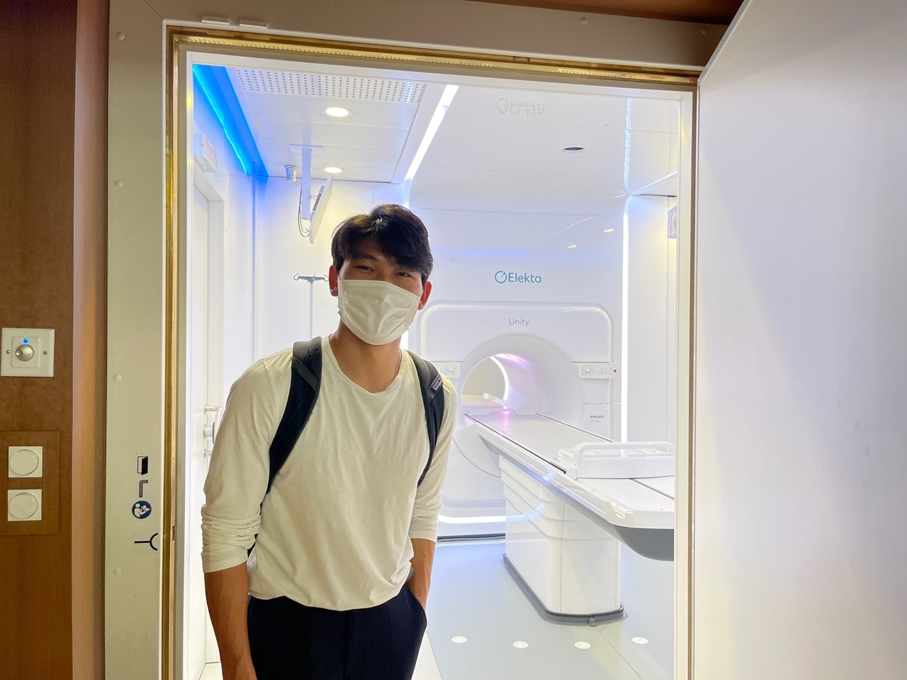
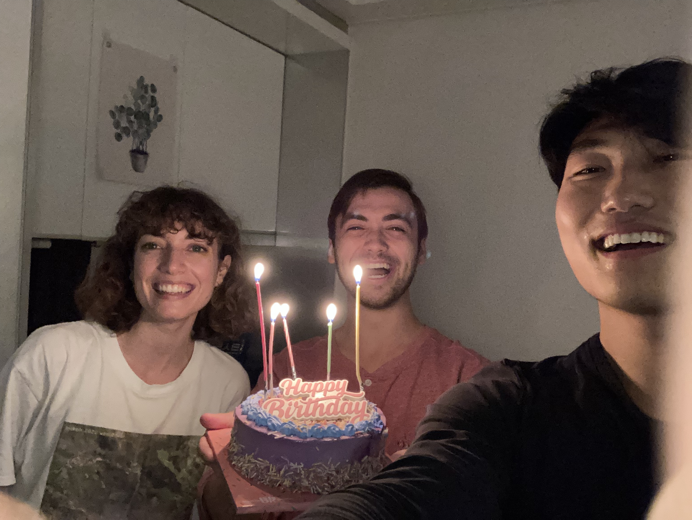

# Caleb's Fulbright Report #2

## Roadmap for Report 
In the first section of my report, I will focus on my research progress for the month of October. In the second section, I will focus on my cultural engagement.  

## Research Progress

### **Medical Conference Gangwon-Do**
This month I attended a Particle Therapy Research conference in Gangwon-Do. The conference was two days long and was held in the Grand Ballroom of Sonobell Vivaldi Park. Professors from KU, Yonsei, Seoul National, and KAIST presented their research. 

During the conference, I found great value in getting to know the people that I work with at the lab better. The 2 day long symposium allowed for many break times at which time I was able to strike up conversations with many of the people in my lab --something I haven't really had much opportunity to do during the workday. 

From making the long drive out to Gangwon-Do blasting music to the in-depth conversations about the merits of different modalities of radiation treatements (prompted by the different research presenations), I found myself constantly engaged and excited throughout the two day trip. 

This trip also served to reinforce my excitement about research topics invovling the use of IMRT, 3-D modeling/contouring, and the impact of AI in the treatment of cancer. It was great to also support the head of our medical physics lab, Dr. Kim, as he presented on the second day of the conference. Below is a picture I took as the conference was being set up.

### **Gangnam Severance Unveiling Ceremony**
Another highlight of this month was the invitation by my supervisor to attend a full day unveiling ceremony of a much anticipated new carbon ion machine. One of the few Carbon ion machines in the world, and the second most expensive purchase by the Severance Hospital in its history, the carbon ion machine was finally completed. 

As my supervisor, Professor Chang, explained to me, the carbon ion machine is a superior alternative to photon therapy, the current mainstay of treatment for many types of cancer. The intuition behind the difference in treatment methods is that a heavier particle like carbon is able to be more selective in hitting the target cancerous area because it is less likely to go all the way through human tissue, unlike photon beams which pass all the way through human tissue, since photons has virtually zero mass. Based on this logic, carbon ions are conducive to less toxicity to healthy organs and tissue when used in treatment compared to photon therapy.  

At the engagement, I sat beside two residents at Gangnam severance in the radiation oncology department, both of whom I have gotten to know better over the weeks through shadowing. They explained anything I didn't understand throughout the speaking engagment portion of the commencement. After all the pictures and handing over of awards/plaques to the key donors who have allowed for the construction of the machine over the past several years, I was able to speak more with Dr. Chang.

Dr. Chang explained how everyone in the hospital hierachy was present --from the chairmen of differnt departments to the associate professors to the current residents and fellows. I am grateful to have had this learning experience, not only because it allowed me to learn about the medical landscape of Gangnam Severance and the latest innovations in the field, but also because of the many doctors that I had the chance to meet during the ceremony.

Below is a picture of me by the machine! (intersting fact: my brother actually worked as a software engineer for Elekta, the Swedish company that made the machine!)

Now, I will transition into discussing my progress on several research projects --first introduced in the previous report.

## 1. **Auto segmentation & Deep learning in Breast Cancer Diagnosis**
As a recap: The recent literature in radiation oncology suggests that metastatic breast cancer actually exists on a spectrum rather than being a categorical, black and white diagnosis. The implication is that cases of metastatic cancer previously deemed untreatable are actually treatable now using continued radiation therapy. Now, a big question among radiation oncologists is a question about classification --how can you tell if this pateint qualifies as treatable or not? In this retrospective study, we will be creating a deep learning model that will determine which cases of metastatic breast cancer is treatable. 

This week, I worked on planning out what kind of data we want to query from the Yonsei hospital database. Often times the most time consuming and challenging task is creating the datasets that will be used for training and testing the performance of machine learning algorithms. So, Dr. Chang and I spent a lot of time together this month working out which attributes we want to select that may be relevant to the final endpoint --whether metastatic breast cancer is treatable or not.

I've also been working hard on increasing my knowledge and expereince using Machine Learning packages in python such as SciKit, Pandas, and Matplot. Through this process, I've been gaining a better understanding of the intuition behind why and in what contexts certain types of supervised or unsupervised algos are used. I also realized that I really enjoy this kind of work --using software to identify siginficant patterns in big data. It's incredible to me that people have created open-source packages that make highly complex computations so accessbile to run. 

## 2. **Review article on breast IMRT**  
recap: There is a lot of controversy over whether Intensity-modulated radiation therapy (IMRT) --a more precise and innovative cancer treatment-- should be used for the treatment of breast cancer. In the US, this technology is not widely adopted, while in South Korea, over 97% of clinics and hospitals offer it to cancer patients. In this literature review, we are looking at what exactly makes the question of using IMRT controversial. 

This week, I have been working on establishing the scaffolding for the paper. Taking this high level overview is my responsibility as first author for this paper. I have outsourced tasks to collaborators (i.e., some of Dr. Chang's colleague) in the oncology department to divide and conquer tasks for this paper, especially in areas where I could use the support by experts in the field. 

As I started receiving responses from our collaborators, I have begun sythesizing the constitutive pieces into the scaffolding that I had planned. I look forward to finishing the first draft once hearing back from all our collaborators. 

## 3. **ML with National database & Yonsei data**  
recap: The purpose of this project is to use the korean national database and Yonsei Severance's internal database to identify significant patterns in big clinical data using machine learning algorithms.

I curated and sent out a list of attributes that I would like be included in a dataset that would be used to train and test the performance of machine learning models. I've been working with two of Dr. Chang's colleagues who have access to the national database. I have sent in the requested attributes already, but I am currently still waiting on the dataset with the specified attributes to be sent to me. 

## 4. **VR for Radiotherapy Explanations**  
recap: One of the first prospective, randomized-controlled trials looking at the role that virtual reality can play in mitigating anxiety when breast cancer patients come for treatment. In this study, 100+ breast cancer pateints at the hospital were either placed in the control group (i.e., explanation of radiation therapy via a paper description) or placed in the experimental group (i.e., wore occulus goggles that explained what radiation therapy is and how it works). Levels of anxiety in anticipations for treatment were measured before and after each explanation.  

I worked a lot on editing for this project this month. Since Dr. Chang outsourced certain sections of the paper to different colleagues, he had the overwhelming task of trying to sythesize 6+ edited drafts of the previous manuscript. Dr. Chang asked if I would like to try sythesizing the texts, and I accepted. 

This was a much more challenging task than I thought, mainly due to the challenge of trying to understand precisely what some of the comments left in Korea or broken English meant, then trying to rephrase it in a way that is appropriate to the medical vernacular of our target journal. 

Anyway, despite the challenge of the task, it was fulfilling. All that is left to do now is to go through another round of editing, then we will submit the manuscript to the medical journal. 

## 5. **Project 5: Importance of local ablative therapies for lung metastasis in patients with colorectal cancer**   

recap: Traditionally, secondary metastasis to the lungs is treated with systemic therapy, namely chemo. But, there is more evidence showing that local ablative therapy may be a better alternative to systemic therapy for this condition -> higher overall survival rates. 

This month, I worked with Dr. Chang closely to make sure that he was able to articulate and express clearly what he wanted to say in this paper. I believe that, similar to the VR mansucript, this project is getting closer to submission day to a medical journal. 

## Cultural Immersion
In this next section, I am going to use images to take you through some cutlural highlights of this past month in Korea. 

This month was my birthday! Whoo! I celebrate with two of my good friends who are ETA fulbright students.

I went to the busan film festival for a weekend with my freinds! 

I made 김찌찜 with my Korean friend Sean!

## Challenges/Difficulties
I have been a bit tired at work lately. I think its because I have trouble saying no to people asking me for editing help at the Severance hospital. I think that it is defintely one of my strenghts to write/edit medical manuscripts (I have 4 summers of expereince as manscript reviewer), but I think it has been a bit taxing this past month trying edit so many papers. 

Overall, I am loving my time in Korea though. And, this month, I have started being more careful with things like my physical health. I've been eating healthy and working out which has helped me a lot over the course of this month. In other news, I think my weekly tutoring with my Korean tutor has also been really making a big difference in my interactions with Koreans at the Hospital. 

