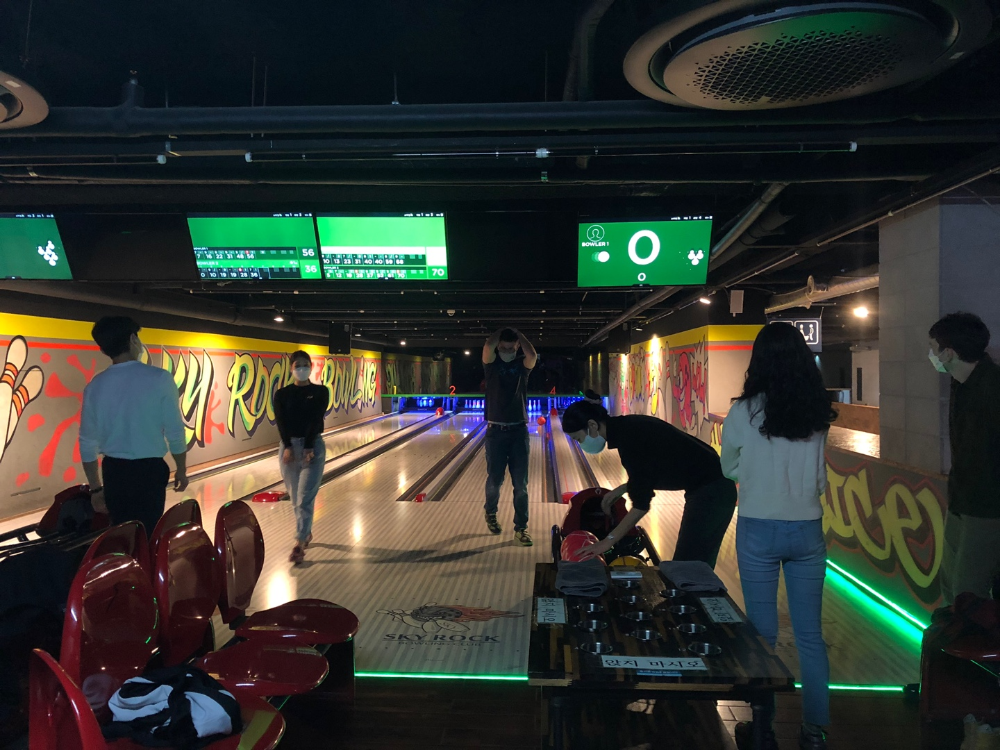
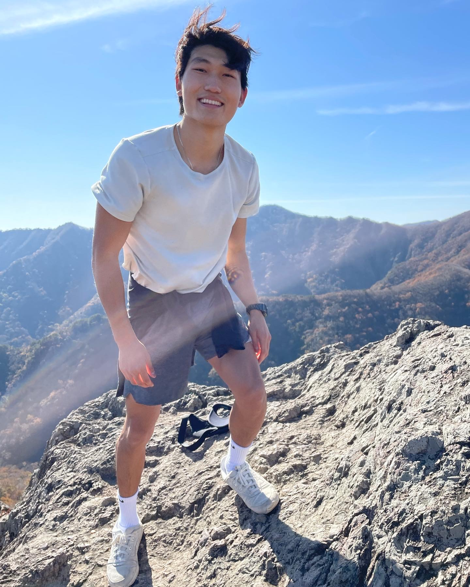

# Caleb's Fulbright Report #3

## Roadmap for Report 
In the first section of my report, I will focus on my research highlights for the month of November. In the second section, I will focus on the highlights of my cultural engagement.  

## Severance Research

### **VR manuscript meeting with co-authors**

At the beginning of the month, I was asked to join a meeting with all the co-authors on the virtual reality paper that I am helping to write. This meeting was incredibly important for me and Dr. Chang because it helped settle a lot of unspoken misunderstanding between us. 

So, just as a recap, Dr. Chang asked me assist with writing the manuscript for a randomized controlled trial investigating the effects of using virtual reality as an alternative method of explaining radiation therapy --a somewhat complex procedure-- to breast cancer patients, to test whether VR can mitigate levels of anxiety before and during treatment. 

With over 4 summers of expereince writing and editing papers on cancer reserach, I am confident in my ability to write and precisely articulate what needs to be said in order to successfully publish a paper in a medical journal like the Lancet --the target journal for this paper. However, I initially ran into a number of problems when trying to write/edit this paper. 

The biggest hurdle had to do with commmuncation. As a manuscript reviewer in the past, I often reviewed and edited papers anonymously, so I didn't have to worry so much about maintaining a relationship the author-- this was helpful because I could be direct with what needed to be fixed. But, in this case, since I am working Dr. Chang almost everyday, I didn't want my candidness to come off as too brash or even rude. So, I spend many hours trying to couch my language in non-critical terms at the cost of not being able to get my point across effectively to Dr. Chang, and this made it really hard to make the changes that I was believed would make the paper better. 

Okay, so back to the meeting and how it helped remedy this problem of miscommunication. In the meeting, there was a doctor from Korea University who was very outspoken. As we made our way throught the paper together, she stopped the conversation and very bluntly told me that it was my role to do the 'story telling' of the manuscript (i.e., re-writing the manuscript so it conforms to the standards/vernacular of the Lancet). I was taken aback by how blunt she was --almost accusatory at times-- but at the same time I admired her directness adn was grateful for her interjection because it gave me the opportunity to explain my predicament --trying to balance maintanence of a good relationship with providing critical feedback. 

Through the dialouge that ensued, I was given the greenlight by all the professors to be as critical as I needed to be in order to make the manuscript great. 

So, after this session, I spent the next week writing my unfiltered comments on how to improve the paper, and with Dr. Chang to answer any of my questions, I was able to put together a fresh copy of the paper that everyone on the team was satisfied with. And, to my surprise, Dr. Chang and his collegues have shown great appreciation for my contribution, and felt very comfortable keeping me on as a co-author on the paper (something that they debated in the weeks prior). 

Overall, this meeting was pivotal for me because it set a precedent for effective communication in future collaborations. 

### **Tennis w/ the Lab & Professor**

In other news, I played a lot of tennis this month with my colleagues at the Severance Hospital. 

To show his appreciate for the work that I've been doing lately, Dr. Chang invited me over to his house to have dinner also play tennis. The whole experience was so much fun! I got to meet his wife (who is also a doctor) and two children (who showed me stories they recently wrote in English). 

After a wonderful dinner, Dr. Chang and I headed out to the tennis courts in his neighborhood and played for 2 hours. The matches were quite close and competitive which made for a fun expereince. I also got to meet some of his neighbors who were out on the courts at the same time. 

Later in the week, I went to go play tennis with the PhD candidates in my medical physics lab. The students were not as skilled as Dr. Chang, but it was still a great opportunity to connect with my colleagues in a non-professional evironment. This month, we have played tennis and got dinner together on two different occassions. I think through expereinces like this, I have finally gotten to the point where all the people in the lab treat me as one of their own --in other words, they are super friendly with me and freely ask me questions about my life. 

### **Visiting Professor UCSF**

More great new this month is that Dr. Chang has received confirmation on a visiting scholarship at USCF beginning next Fall. I have been assiting with correspondence (maining editing emails/personal statements) with different academic hospitals in the US and finally we have heard back from a great potential mentor at USCF who willing to host Dr. Chang for a year of research in California. 

**Now, I will transition into discussing my progress on several research projects I am working on**

## 1. **Local Ablative Therapy Manuscript**
Currently, the main treatment for secondary lung metastases in patients with colerectal cancer is to use surgical intervention. However, a longitudinal, retrospective study conducted at Severance tested the effectiveness of an alternative form of threapy called Local Ablative Treatment which uses radation therapy to kill cancer.  

For the project, I have been tasked with manuscript editing and a secondary task of identifying significant patterns in the data. This month I have been maninly cleaning up the data in excel. Once it is all cleaned, I will run some supervised machine learning algorithms on the data to create models on different attributes and check the performance of the models.  

## 2. **Review article on breast IMRT**  
recap: There is a lot of controversy over whether Intensity-modulated radiation therapy (IMRT) --a more precise and innovative cancer treatment-- should be used for the treatment of breast cancer. In the US, this technology is not widely adopted, while in South Korea, over 97% of clinics and hospitals offer it to cancer patients. In this literature review, we are looking at what exactly makes the question of using IMRT controversial. 

This month, I was still waiting on contributions from the collaborators to proceed with this project. I sat in for two poster presentations delivered on this topic where I learned more statistics on the use of breast IMRT across South Korea.

## 3. **ML with National database & Yonsei data**  
recap: The purpose of this project is to use the korean national database and Yonsei Severance's internal database to identify significant patterns in big clinical data using machine learning algorithms.

I am currently still waiting for the datasets that I requested.

## 4. **VR for Radiotherapy Explanations**  
recap: One of the first prospective, randomized-controlled trials looking at the role that virtual reality can play in mitigating anxiety when breast cancer patients come for treatment. In this study, 100+ breast cancer pateints at the hospital were either placed in the control group (i.e., explanation of radiation therapy via a paper description) or placed in the experimental group (i.e., wore occulus goggles that explained what radiation therapy is and how it works). Levels of anxiety in anticipations for treatment were measured before and after each explanation.  

(see beginning of journal entry "VR manuscript meeting with co-authors")

## Cultural Immersion
In this next section, I am going to use images to take you through some cutlural highlights of this past month in Korea. 

I joined a Yonsei group on campus called YES (Yonsei English Society). This past week, we bonded over bowling! 

I went to the Hanok village with some of my friends!

I went to 내장산 and took this photo at the peak! 

## Looking Forward
Dr. Chang got me a book called Machine Learning in Radiation Oncology that I've been making my way through this month. I've been taking notes throughout my reading, and I look forward to talking to him about some questions I have. 

This Thursday, Gangnam Severance is hosting a research symposium at the Josung Place Hotel in Gangnam. Dr. Chang invited me so I am excited to attend!

